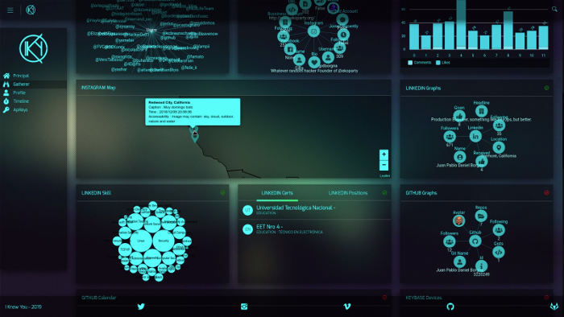

<div align="center">
    <a href="https://twitter.com/intent/follow?screen_name=kennbroorg">
	
    </a>
</div>

---

<div align="center">
    
    
    
    
</div>
<div align="center">
    
    
    
    
</div>
<div align="center">
    
    
    
    
    
    
    
    
    
    
    
    
    
    
    
    
    
    
    
    
</div>

---

<div align="center">
    <a href="https://gitlab.com/kennbroorg/iKy/blob/iKy/README.md">
	
    </a>
</div>

---

<div align="center" style="background: #111">
    
</div>

---

# iKy

## Descripción

El proyecto iKy es una herramienta que colecta información a partir de una dirección de e-mail y muestra los resultados en una interface visual.

Visite el Gitlab Page del [Projecto](https://kennbroorg.gitlab.io/ikyweb/)

<div align="center">
    <a href="https://vimeo.com/347085110"></a>
</div>

[Video Demo](https://vimeo.com/434501702 "Video Demo - Click to Watch!")


## Instalación

### Clonar el repositorio

```shell
git clone https://gitlab.com/kennbroorg/iKy.git
```

### Instalar Backend

#### Redis

Se debe instalar Redis

```shell
wget http://download.redis.io/redis-stable.tar.gz
tar xvzf redis-stable.tar.gz
cd redis-stable
make
sudo make install
```

#### Python y Celery

Se debe instalar las librerías en requirements.txt

```shell
python3 -m pip install -r requirements.txt
```

### Instalar Frontend

#### Node

Primero que nada, instalar [nodejs](https://nodejs.org/es/).

#### Dependencias

Dentro del directorio **frontend** instalar las dependencias

```shell
cd frontend
npm install
```


## Encender iKy Tool

### Encender el Backend

#### Redis

Y ejecutar el server en una terminal

```shell
redis-server
```

#### Python y Celery

Ejecutar celery en otra terminal, dentro del directorio **backend**

```shell
cd backend
./celery.sh
```

Otra vez, en otra terminal ejecutar app.py dentro del directorio **backend** 

```shell
python3 app.py
```

### Encender el Frontend

Finalmente, ejecutar dentro del directorio **frontend** el siguiente comando :

```shell
npm start
```

### Pantalla luego de encender iKy

<div align="center">
    
</div>

### Browser

Abrir el browser en esta [url](http://127.0.0.1:4200)

### Config API Keys

Una vez que la aplicación esté cargada en el browser, deberá ir a la opción Api Keys y llenar los valores de las APIs que se necesitan.

- Fullcontact : Generar las APIs desde [aquí](https://support.fullcontact.com/hc/en-us/articles/115003415888-Getting-Started-FullContact-v2-APIs)
- PeopleDataLabs : Generar las APIs desde [aquí](https://www.peopledatalabs.com/signup)
- Linkedin : Solo se debe cargar el usuario y contraseña de su cuenta 
- Instagram : Solo se debe cargar el usuario y contraseña de su cuenta 
- HaveIBeenPwned : Generar las APIs desde [aquí](https://haveibeenpwned.com/API/Key) (Paga)
- Emailrep.io : Generar las APIs desde [aqui](https://emailrep.io/key)
- Leaklookup : Generar las APIs desde [aqui](https://leak-lookup.com/api)
- Twitter: Generar las APIs desde [aqui](https://developer.twitter.com/en/docs/basics/authentication/guides/access-tokens.html)


# Wiki
- [iKy Wiki](https://gitlab.com/kennbroorg/iKy/-/wikis/home)
- [iKy Page](https://kennbroorg.gitlab.io/ikyweb/)
- Installation
  - [Easy Install](https://gitlab.com/kennbroorg/iKy/-/wikis/Installation/EasyInstall)
  - [Vagrant](https://gitlab.com/kennbroorg/iKy/-/wikis/Installation/Vagrant)
  - [Manual install (Compacted)](https://gitlab.com/kennbroorg/iKy/-/wikis/Installation/Manual-install-(Compacted))
  - [Manual install (Detailed)](https://gitlab.com/kennbroorg/iKy/-/wikis/Installation/Manual-install-(Detailed))
- Update
  - [Soft Update](https://gitlab.com/kennbroorg/iKy/-/wikis/Update/Soft)
- Wake Up 
  - [Turn on the project](https://gitlab.com/kennbroorg/iKy/-/wikis/Wakeup/WakeUp)
- APIs
  - [APIs through frontend](https://gitlab.com/kennbroorg/iKy/-/wikis/APIs/ApiKeys-through-the-browser)
  - [APIs through backend](https://gitlab.com/kennbroorg/iKy/-/wikis/APIs/APIs-through-the-backend)
- Backend
  - [Backend through URL](https://gitlab.com/kennbroorg/iKy/-/wikis/Backend/Backend-through-url)
- Videos
  - [Installation videos](https://gitlab.com/kennbroorg/iKy/-/wikis/Videos/Installations)
    - [Installation in Kali 2019](https://vimeo.com/350877994) 
    - [Installation in ubuntu 18.04](https://vimeo.com/347435255) 
    - [Installation in ubuntu 16.04](https://vimeo.com/332359273) 
  - [Demo videos](https://gitlab.com/kennbroorg/iKy/-/wikis/Videos/Demos)
    - [iKy eko15](https://vimeo.com/397862772)
    - [iKy version 2](https://vimeo.com/347085110)
    - [Testing iKy with Emiliano](https://vimeo.com/349011105)
    - [Testing iKy with Giba](https://vimeo.com/342843348)
    - [iKy version 1](https://vimeo.com/326114716)
    - [iKy version 0](https://vimeo.com/272495754)
- [Disclaimer](https://gitlab.com/kennbroorg/iKy/-/wikis/Disclaimer)

## Video Demo

<div align="center">
    <a href="https://vimeo.com/434501702"></a>
    <p>iKy eko15</p>
</div>

## Aviso Legal

Todo aquel que contribuya o haya contribuído con el proyecto, incluyendome, no somos responsables por el uso de la herramienta (Ni el uso legal ni el uso ilegal, ni el "otro" uso). 

Tenga en cuenta que este software fue inicialmente escrito para una broma, luego con fines educativos (para educarnos a nosotros mismos), y ahora el objetivo es colaborar con la comunidad haciendo software libre de calidad, y si bien la calidad no es excelente (a veces ni siquiera buena) nos esforzamos en perseguir la excelencia.

Considere que toda la informacion recolectada está libre y disponible por internet, la herramienta solo intenta descubrirla, recolectarla y mostrarla.
Muchas veces la herramienta ni siquiera puede lograr su objetivo de descubrimiento y recolección. Por favor, cargue las APIs necesarias antes de acordarse de mi madre.
Si aún con las APIs no muestra cosas "lindas" que usted espera ver, pruebe con otros e-mails antes de acordarse de mi madre.
Si aún probando con otros e-mails no ve las cosas "lindas" que usted espera ver, puede crear un issue, contactarnos por e-mail o por cualquiera de las RRSS, pero tenga en cuenta que mi madre no es ni la creadora ni contribuye con el proyecto.

No reembolsamos su dinero si no está satisfecho.

Espero que disfrute la utilizacion de la herramienta tanto como nosotros disfrutamos hacerla. El esfuerzo fue y es enorme (Tiempo, conocimiento, codificacion, pruebas, revisiones, etc) pero lo haríamos de nuevo.

No use la herramienta si no puede leer claramente las instrucciones y/o el presente Aviso Legal.

Por cierto, para quienes insistan en acordarse de mi madre, ella murió hace muchos años pero la amo como si estuviera aquí mismo.

[readmees]: README.es.md
[readmeen]: README.md
