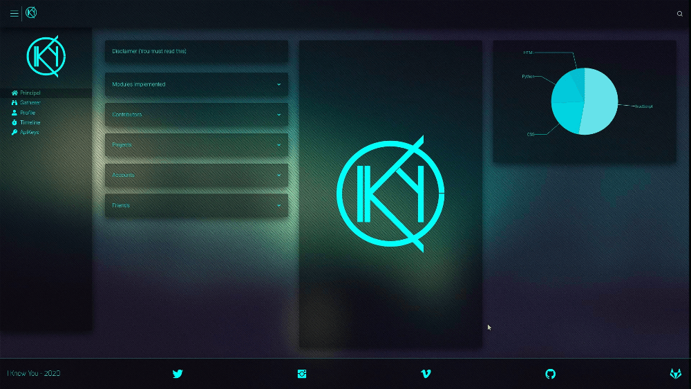

<div align="center" style="margin-bottom: 10px;">
    
    
    
    
    
    
    
</div>

<div align="center">
    <a href="https://gitlab.com/kennbroorg/iKy/blob/iKy/README.md">
	
    </a>
</div>

---

<div align="center">
    
</div>

---

[Descripcion](#description)&nbsp;&nbsp;&nbsp;|&nbsp;&nbsp;&nbsp;[Instalacion](#installation)&nbsp;&nbsp;&nbsp;|&nbsp;&nbsp;&nbsp;[Website][website]&nbsp;&nbsp;&nbsp;|&nbsp;&nbsp;&nbsp;[Modulos](#modules)&nbsp;&nbsp;&nbsp;|&nbsp;&nbsp;&nbsp;[Issues][issues]&nbsp;&nbsp;&nbsp;|&nbsp;&nbsp;&nbsp;[Supporting](#sponsor)

---

[website]:https://kennbroorg.gitlab.io/ikyweb/
[issues]:https://gitlab.com/kennbroorg/iKy/-/issues/new?issue%5Bassignee_id%5D=&issue%5Bmilestone_id%5D=
[readmees]: README.es.md
[readmeen]: README.md

<h1 align="center">iKy</h1>

<h1 id="description">Descripcion</h1>

iKy es una herramienta OSINT que colecta informacion a partir de una direccion de e-mail u otros selectores y muestra los resultados en una interface visual.

<div align="center">
    <a href="https://vimeo.com/434501702"></a>
</div>
<div align="center">
    <em>(pendiente de actualizacion: refleja el frontend anterior)</em>
    <br>
    <a href="https://vimeo.com/434501702">Video Demo</a>
</div>

<h1 id="installation">Instalacion</h1>

### Prerequisitos

- [Docker](https://docs.docker.com/get-docker/)
- [Docker Compose](https://docs.docker.com/compose/install/) (incluido con Docker Desktop)
- (Opcional) [just](https://github.com/casey/just#installation) ejecutor de tareas

### Inicio rapido

```shell
git clone https://gitlab.com/kennbroorg/iKy.git
cd iKy
just build
just up
```

Abra su navegador en [http://localhost:4300](http://localhost:4300)

Para detener todos los servicios:

```shell
just down
```

> `just up` inicia `backend`, `iky-frontend` y `redis`. No se levanta ningun otro servicio por defecto.

### Sin Docker (nativo)

Si no puede usar Docker, iKy puede correr de forma nativa: Caddy sirve el
frontend pre-compilado y Redis + Celery + Uvicorn corren como procesos locales.
Requiere `redis-server`, Python 3.12, `curl` y `tar` en el host (Caddy se
descarga automaticamente).

```shell
just setup          # crear el venv
just up-native      # instala deps, descarga Caddy + frontend, levanta todo
```

Abra su navegador en [http://localhost:4300](http://localhost:4300). Detenga con Ctrl-C o `just down-native`.

> El frontend se descarga del ultimo release de GitHub — sin build de Node.
> `tor` no se levanta en modo nativo; solo el modulo `darkweb` lo necesita.

<h1 id="architecture">Arquitectura</h1>

| Servicio | Stack | Puerto |
|----------|-------|--------|
| backend | FastAPI 0.115 + Celery 5.6 | 5000 |
| iky-frontend | Angular 21 + nginx | 4300 |
| redis | Redis 7 | 56379 (host) |
| tor | Proxy SOCKS5 (modulo darkweb) | interno |

<h1 id="modules">Modulos</h1>

iKy enruta 26 modulos a traves de `backend/module_registry.py`:

| Categoria | Modulos |
|-----------|---------|
| Redes sociales | twitter, linkedin, instagram, tiktok, mastodon, twitch, reddit |
| Identidad / usuario | github, gitlab, keybase, sherlock, socialscan, holehe, usersearch, skype |
| Citas / pagos | tinder, venmo |
| Musica | spotify |
| Reputacion / data brokers | peopledatalabs, emailrep, fullcontact |
| Filtraciones / brechas | leaks, leaklookup, darkweb, hudsonrock |
| Busqueda | search |

<h1 id="api-keys">API Keys</h1>

Una vez cargada la aplicacion en el navegador, deberia obtener la mayoria de las APIs y/o cookies de sesion del navegador.
A continuacion se muestra una tabla con todos los campos a rellenar

|   **Modulo**   | **Status** | **Campo en apikey** | **Como obtenerla** |
| :------------- | :--------: | :------------------ | :----------------- |
| Linkedin       | :ok: :cookie: | `linkedin_cookies` (o legacy `linkedin_li_at` / `linkedin_JSESSIONID`) | `just cookies-grab linkedin linkedin.com` o `just cookies-import linkedin <archivo>` |
| Twitter        | :ok: :cookie: | `twitter_cookies` | `just cookies-grab twitter x.com` |
| Tiktok         | :ok: :cookie: | `tiktok_cookies` | `just cookies-grab tiktok tiktok.com` |
| PeopleDataLabs | :ok: | `peopledatalabs_key` | :free: API **Free** — [wiki](https://gitlab.com/kennbroorg/iKy/-/wikis/APIs/ApiKeys-get#peopledatalabs) |
| Emailrep       | :ok: | `emailrep_key` | :free: API **Free** — [wiki](https://gitlab.com/kennbroorg/iKy/-/wikis/APIs/ApiKeys-get#emailrep) |
| Leaklookup     | :ok: | `leaklookup_key` | :free: API **Free** — [wiki](https://gitlab.com/kennbroorg/iKy/-/wikis/APIs/ApiKeys-get#leaklookup) |
| Spotify        | :ok: | `spotify_client_id` / `spotify_client_secret` | :free: API **Free** — [wiki](https://gitlab.com/kennbroorg/iKy/-/wikis/APIs/ApiKeys-get#spotify) |
| Twitch         | :ok: | `twitch_client_id` / `twitch_client_secret` | :free: API **Free** — [wiki](https://gitlab.com/kennbroorg/iKy/-/wikis/APIs/ApiKeys-get#twitch) |
| CSE (Google)   | :ok: | `cse_api_key` / `cse_cx` | :free: API **Free** — [wiki](https://gitlab.com/kennbroorg/iKy/-/wikis/APIs/ApiKeys-get#cse) |
| Brave          | :ok: | `brave_key` | :free: API **Free** |
| Instagram      | :warning: | `instagram_user` / `instagram_pass` | En revision |
| Fullcontact    | :stop_sign: | `fullcontact_api` | Discontinuado |
| HaveIBeenPwned | :stop_sign: | `haveibeenpwned_key` | Discontinuado |

> Las APIs marcadas con :cookie: usan cookies de sesion del navegador; el resto
> usan tokens de servicio.

<h1 id="cookies">Cookies de sesion</h1>

Algunos modulos (LinkedIn, Twitter, TikTok) necesitan cookies de sesion de su
navegador para obtener informacion. Las cookies se guardan en `backend/cookies/`
(montado en el contenedor como `/app/cookies`) y persisten entre reinicios. Hay
dos formas de cargarlas, ambas mediante `just`.

> Las cookies son tokens de sesion personales: no las comparta ni las suba al
> repositorio (`backend/cookies/` esta ignorado por git).

### Opcion A: Importar un export del navegador

Exporte las cookies del sitio con una extension tipo Cookie-Editor a un archivo
JSON e importelo:

```shell
just cookies-import linkedin ~/Descargas/linkedin_cookies.json
```

### Opcion B: Obtenerlas automaticamente del navegador

Extrae las cookies directamente de su navegador local. Cierre el navegador antes
de ejecutarlo (un navegador abierto bloquea su base de cookies):

```shell
# Prueba todos los navegadores instalados (firefox, chrome, brave, edge)
just cookies-grab linkedin linkedin.com

# O uno especifico
just cookies-grab linkedin linkedin.com brave
```

El comando informa, navegador por navegador, que pudo leer y que no, y escribe el
archivo solo si encuentra las cookies que el modulo necesita. Por ejemplo,
LinkedIn requiere `li_at` y `JSESSIONID`.

| Modulo | Dominio | Cookies requeridas |
| :----- | :------ | :----------------- |
| LinkedIn | linkedin.com | `li_at`, `JSESSIONID` |
| Twitter | x.com | `auth_token`, `ct0` |
| TikTok | tiktok.com | `msToken` |

> Las cookies vencen cada cierto tiempo (las de LinkedIn duran entre 1 y 3
> meses). Cuando un modulo deje de autenticarse, vuelva a ejecutar el comando.

<h1 id="development">Desarrollo</h1>

El flujo de desarrollo utiliza un **virtualenv para linting/pre-commit hooks** y **Docker (o el flujo nativo `just up-native`) para compilar y ejecutar** la aplicacion.

### Configurar el entorno de desarrollo

Instale [just](https://github.com/casey/just#installation), luego:

```shell
just setup
source .venv/bin/activate
```

Esto crea un virtualenv de Python con `pre-commit` y `ruff`, e instala los git hooks.

### Recetas comunes

| Comando | Descripcion |
|---------|-------------|
| `just build` | Compilar imagenes Docker |
| `just up` | Iniciar todos los servicios |
| `just down` | Detener todos los servicios |
| `just logs` | Seguir logs del backend (`just logs frontend` para frontend) |
| `just ps` | Mostrar contenedores en ejecucion |
| `just shell-backend` | Abrir una shell en el contenedor del backend |
| `just lint` | Ejecutar ruff linter y verificacion de formato |
| `just fmt` | Auto-formatear codigo Python |
| `just restart backend` | Reiniciar un servicio especifico |
| `just rebuild` | Detener, recompilar e iniciar todos los servicios |
| `just clean` | Eliminar contenedores, volumenes e imagenes locales |
| `just up-native` | Iniciar iKy de forma nativa (sin Docker) |
| `just down-native` | Detener los servicios nativos |
| `just up-native-clean` | Limpiar caches nativas (Caddy, frontend, logs) |

<h1 id="update">Actualizar iKy</h1>

Descargue los ultimos cambios y reconstruya las imagenes Docker:

```shell
git pull
just rebuild
```

Para preservar sus API keys entre actualizaciones, use las opciones de Exportar/Importar en el menu de apikeys de la interface grafica.

<div align="center">
    
</div>
<div align="center">
    <em>(pendiente de actualizacion: refleja el frontend anterior)</em>
</div>

# Wiki
- [iKy Wiki](https://gitlab.com/kennbroorg/iKy/-/wikis/home) (En actualización)

# Video Demo

<div align="center">
    <a href="https://vimeo.com/434501702"></a>
    <p>Vimeo</p>
</div>
<div align="center">
    <em>(pendiente de actualizacion: refleja el frontend anterior)</em>
</div>

<h1 id="sponsor">Apoyar el proyecto</h1>
Ya sea que use este proyecto, haya aprendido algo de el o simplemente le guste, por favor considere apoyarlo comprandome un cafe, para que pueda dedicar mas tiempo a proyectos de codigo abierto como este.

<div align="center" style="margin-top: 30px;">
<a href="https://www.buymeacoffee.com/kennbro" target="_blank"></a>
</div>

# Aviso Legal

Todo aquel que contribuya o haya contribuido con el proyecto, incluyendome, no somos responsables por el uso de la herramienta (Ni el uso legal ni el uso ilegal, ni el "otro" uso).

Tenga en cuenta que este software fue inicialmente escrito para una broma, luego con fines educativos (para educarnos a nosotros mismos), y ahora el objetivo es colaborar con la comunidad haciendo software libre de calidad, y si bien la calidad no es excelente (a veces ni siquiera buena) nos esforzamos en perseguir la excelencia.

Considere que toda la informacion recolectada esta libre y disponible por internet, la herramienta solo intenta descubrirla, recolectarla y mostrarla.
Muchas veces la herramienta ni siquiera puede lograr su objetivo de descubrimiento y recoleccion. Por favor, cargue las APIs necesarias antes de acordarse de mi madre.
Si aun con las APIs no muestra cosas "lindas" que usted espera ver, pruebe con otros e-mails antes de acordarse de mi madre.
Si aun probando con otros e-mails no ve las cosas "lindas" que usted espera ver, puede crear un issue, contactarnos por e-mail o por cualquiera de las RRSS, pero tenga en cuenta que mi madre no es ni la creadora ni contribuye con el proyecto.

No reembolsamos su dinero si no esta satisfecho.

Espero que disfrute la utilizacion de la herramienta tanto como nosotros disfrutamos hacerla. El esfuerzo fue y es enorme (Tiempo, conocimiento, codificacion, pruebas, revisiones, etc) pero lo hariamos de nuevo.

No use la herramienta si no puede leer claramente las instrucciones y/o el presente Aviso Legal.

Por cierto, para quienes insistan en acordarse de mi madre, ella murio hace muchos anos pero la amo como si estuviera aqui mismo.
