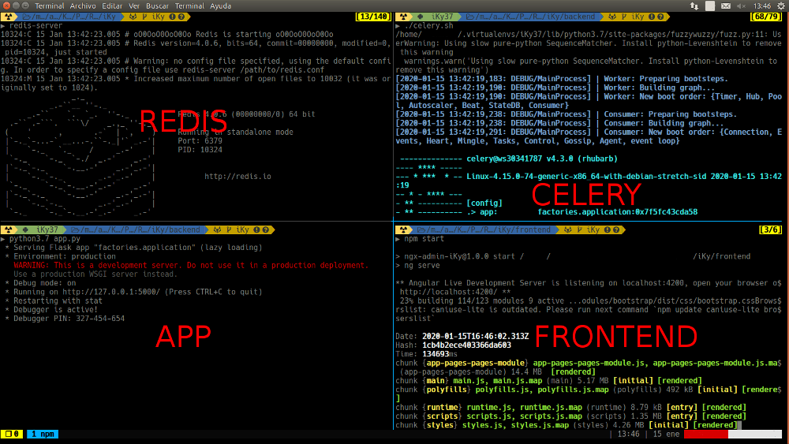

<div align="center" style="margin-bottom: 10px;">
    <a href="https://twitter.com/intent/follow?screen_name=kennbroorg">
	
    </a>
</div>

<div align="center" style="margin-bottom: 10px;">
    
    
    
    
    
    
</div>

<!--
<div align="center" style="margin-bottom: 10px;">
    
    
</div>
-->

<div align="center">
    <a href="https://gitlab.com/kennbroorg/iKy/blob/iKy/README.es.md">
	
    </a>
</div>

---

<div align="center">
    
</div>

---

<div align="center">   

[Description](#description)&nbsp;&nbsp;&nbsp;|&nbsp;&nbsp;&nbsp;[Installation](#installation)&nbsp;&nbsp;&nbsp;|&nbsp;&nbsp;&nbsp;[Website][website]&nbsp;&nbsp;&nbsp;|&nbsp;&nbsp;&nbsp;[Modules](#modules)&nbsp;&nbsp;&nbsp;|&nbsp;&nbsp;&nbsp;[Issues][issues]&nbsp;&nbsp;&nbsp;|&nbsp;&nbsp;&nbsp;[Supporting](#sponsor)

</div>

---

<!--
Website References
-->
[website]:https://kennbroorg.gitlab.io/ikyweb/
[issues]:https://gitlab.com/kennbroorg/iKy/-/issues/new?issue%5Bassignee_id%5D=&issue%5Bmilestone_id%5D=
[readmees]: README.es.md
[readmeen]: README.md

<h1 align="center">iKy</h1>

<h1 id="description">Description</h1>
Project iKy is a tool that collects information from an email and shows results in a nice visual interface.

Visit the Gitlab Page of the [Project](https://kennbroorg.gitlab.io/ikyweb/)

<div align="center">
    <a href="https://vimeo.com/434501702"></a>
</div>

[Video Demo](https://vimeo.com/434501702 "Video Demo - Click to Watch!")

<h2 id="modules">Modules</h2>

<div align="center" style="margin-bottom: 10px;">
    
    
    
    
    
    
    
    
    
    
    
    
    
    
    
    
    
    
    
    
</div>

<h1 id="installation">Installation</h1>

<div align="left" style="margin-bottom: 10px;">
    <h2> Easy installation (Python only)</h2>
</div>

You must install Redis

```shell
wget http://download.redis.io/redis-stable.tar.gz
tar xvzf redis-stable.tar.gz
cd redis-stable
make
sudo make install
```

Go to our [website][website]. Download the ZIP file and unzip it.
```
unzip iKy.zip
cd iKy-pack
pip install -r requirements.txt
cd backend
python app.py -e prod
```

And, finally, [browse](#browse) it.

## Full installation (DEV)

### Clone repository

```shell
git clone https://gitlab.com/kennbroorg/iKy.git
```

### Install Backend

#### Redis

You must install Redis

```shell
wget http://download.redis.io/redis-stable.tar.gz
tar xvzf redis-stable.tar.gz
cd redis-stable
make
sudo make install
```

#### Python stuff and Celery

You must install the libraries inside requirements.txt

```shell
python3 -m pip install -r requirements.txt
```

### Install Frontend

#### Node

First of all, install [nodejs](https://nodejs.org/en/).

#### Dependencias

Inside the directory **frontend** install the dependencies

```shell
cd frontend
npm install
```

## Wake up iKy Tool

### Turn on Backend

#### Redis

Turn on the server in a terminal

```shell
redis-server
```

#### Python stuff and Celery

Turn on Celery in another terminal, within the directory **backend**

```shell
./celery.sh
```

Again, in another terminal turn on backend app from directory **backend** 

```shell
python3 app.py
```

### Turn on Frontend

Finally, to run frontend server, execute the following command from directory **frontend**

```shell
npm start
```

<!--
### Screen after turn on iKy

<div align="center">
    
</div>
-->

<h3 id="browser">Browse</h3>

Open the browser in this [url](http://127.0.0.1:4200) 

### Config API Keys

Once the application is loaded in the browser, you should go to the Api Keys option and load the values of the APIs that are needed.

- Fullcontact: Generate the APIs from [here](https://support.fullcontact.com/hc/en-us/articles/115003415888-Getting-Started-FullContact-v2-APIs)
- PeopleDataLabs : Generate the APIs from [aquí](https://www.peopledatalabs.com/signup)
- Linkedin: Only the user and password of your account must be loaded
- Instagram: Only the user and password of your account must be loaded
- HaveIBeenPwned : Generate the APIs from [here](https://haveibeenpwned.com/API/Key) (Paid)
- Emailrep.io : Generate the APIs from [here](https://emailrep.io/key)
- Leaklookup : Generate the APIs from [here](https://leak-lookup.com/api)
- Twitter: Generate the APIs from [here](https://developer.twitter.com/en/docs/basics/authentication/guides/access-tokens.html)

# Wiki

- [iKy Wiki](https://gitlab.com/kennbroorg/iKy/-/wikis/home)
- [iKy Page](https://kennbroorg.gitlab.io/ikyweb/)
- Installation
  - [Easy Install](https://gitlab.com/kennbroorg/iKy/-/wikis/Installation/EasyInstall)
  - [Vagrant](https://gitlab.com/kennbroorg/iKy/-/wikis/Installation/Vagrant)
  - [Manual install (Compacted)](https://gitlab.com/kennbroorg/iKy/-/wikis/Installation/Manual-install-(Compacted))
  - [Manual install (Detailed)](https://gitlab.com/kennbroorg/iKy/-/wikis/Installation/Manual-install-(Detailed))
- Update
  - [Soft Update](https://gitlab.com/kennbroorg/iKy/-/wikis/Update/Soft)
- Wake Up 
  - [Turn on the project](https://gitlab.com/kennbroorg/iKy/-/wikis/Wakeup/WakeUp)
- APIs
  - [APIs through frontend](https://gitlab.com/kennbroorg/iKy/-/wikis/APIs/ApiKeys-through-the-browser)
  - [APIs through backend](https://gitlab.com/kennbroorg/iKy/-/wikis/APIs/APIs-through-the-backend)
- Backend
  - [Backend through URL](https://gitlab.com/kennbroorg/iKy/-/wikis/Backend/Backend-through-url)
- Videos
  - [Installation videos](https://gitlab.com/kennbroorg/iKy/-/wikis/Videos/Installations)
    - [Installation in Kali 2019](https://vimeo.com/350877994) 
    - [Installation in ubuntu 18.04](https://vimeo.com/347435255) 
    - [Installation in ubuntu 16.04](https://vimeo.com/332359273) 
  - [Demo videos](https://gitlab.com/kennbroorg/iKy/-/wikis/Videos/Demos)
    - [iKy eko15](https://vimeo.com/397862772)
    - [iKy version 2](https://vimeo.com/347085110)
    - [Testing iKy with Emiliano](https://vimeo.com/349011105)
    - [Testing iKy with Giba](https://vimeo.com/342843348)
    - [iKy version 1](https://vimeo.com/326114716)
    - [iKy version 0](https://vimeo.com/272495754)
- [Disclaimer](https://gitlab.com/kennbroorg/iKy/-/wikis/Disclaimer)

## Demo Video

<div align="center">
    <a href="https://vimeo.com/434501702"></a>
    <p>Vimeo</p>
</div>

<h1 id="sponsor">Support the project</h1>
Whether you use this project, have learned something from it, or just like it, please consider supporting it by buying me a coffee, so I can dedicate more time on open-source projects like this.

<div align="center" style="margin-top: 30px;">
<a href="https://www.buymeacoffee.com/kennbro" target="_blank"></a>
</div>

# Disclaimer

Anyone who contributes or contributed to the project, including me, is not responsible for the use of the tool (Neither the legal use nor the illegal use, nor the "other" use).

Keep in mind that this software was initially written for a joke, then for educational purposes (to educate ourselves), and now the goal is to collaborate with the community making quality free software, and while the quality is not excellent (sometimes not even good) we strive to pursue excellence.

Consider that all the information collected is free and available online, the tool only tries to discover, collect and display it.
Many times the tool cannot even achieve its goal of discovery and collection. Please load the necessary APIs before remembering my mother.
If even with the APIs it doesn't show "nice" things that you expect to see, try other e-mails before you remember my mother.
If you still do not see the "nice" things you expect to see, you can create an issue, contact us by e-mail or by any of the RRSS, but keep in mind that my mother is neither the creator nor Contribute to the project.

We do not refund your money if you are not satisfied.
I hope you enjoy using the tool as much as we enjoy doing it. The effort was and is enormous (Time, knowledge, coding, tests, reviews, etc.) but we would do it again.
Do not use the tool if you cannot read the instructions and / or this disclaimer clearly.

By the way, for those who insist on remembering my mother, she died many years ago but I love her as if she were right here.
